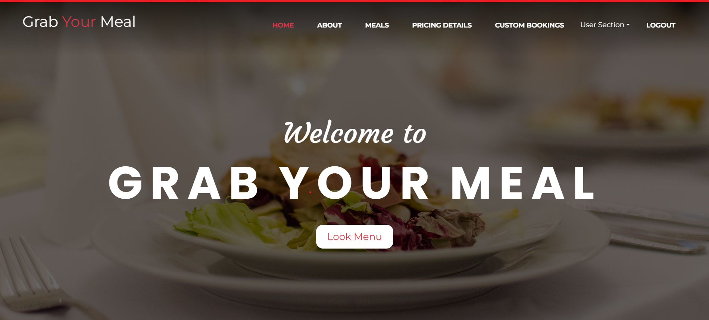
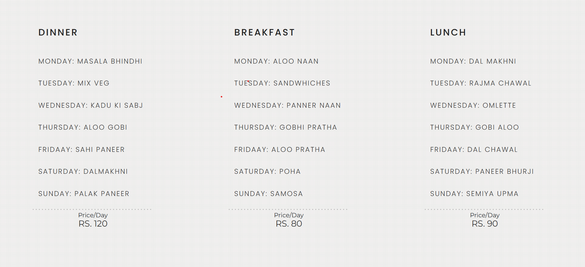
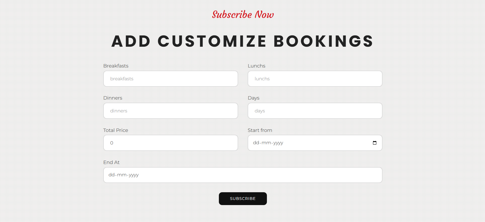
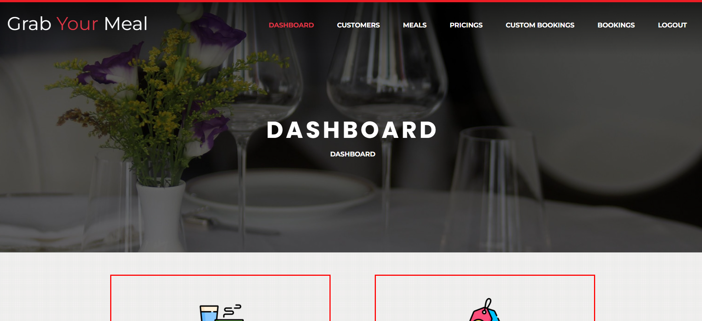
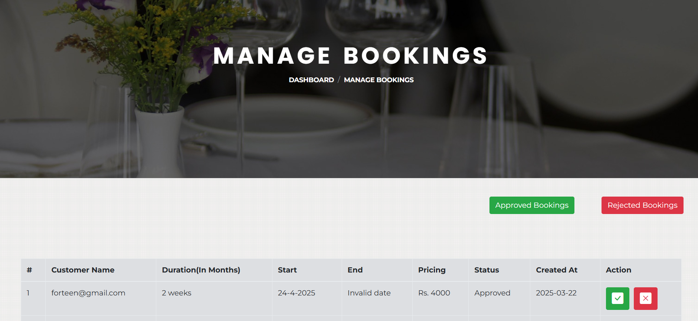
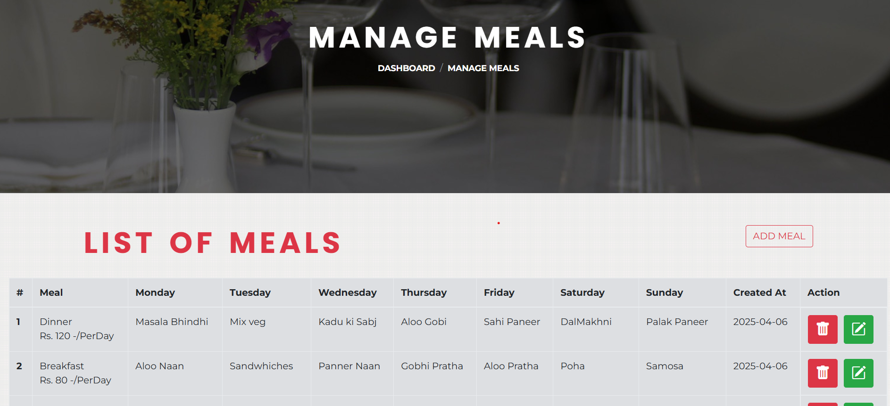

# 🍴 Dial A Meal– React + Firebase

**Dial A Meal** is a tiffin subscription web app using React and Firebase. It supports customer meal bookings for 1 month, 2 months, or a custom number of days. Admin can manage bookings, change status, and handle pricing plans.

---

## 🧩 Features

### 👤 Customer Panel

- Firebase Auth Login/Register
- Book Meals:
  - 1 Month
  - 2 Months
  - Custom Days
- Track Booking Status
- Profile Page

### 👨‍🍳 Admin Panel

- Manage customers and update their status
- Manage meals and update
- Manage pricing plans and update
- View & Update All Bookings
- Change Booking Status: Pending, Approved, Cancelled, Rejected

---

## 🛠️ Tech Stack

- **Frontend:** React.js
- **Backend:** Firebase Firestore
- **Authentication:** Firebase Auth
- **UI Framework:** Bootstrap/Tailwind CSS

---

## 📁 Folder Structure

## 📁 Folder Structure

### 🔷 React + Firebase Version

<details>
<summary>
<strong>
dial-a-meal-mern/
├── client/                        # React frontend
│   ├── public/
│   ├── src/
│   │   ├── components/
│   │   │   ├── admin/
│   │   │   │   ├── layout/
│   │   │   │   └── pages/
│   │   │   ├── customer/
│   │   │   │   ├── layout/
│   │   │   │   └── pages/
│   │   │   ├── auth/
│   │   │   └── common/
│   │   ├── App.js
│   │   ├── index.js
│   │   └── routes.js
│   ├── .env
│   └── package.json
│
├── server/                        # Node + Express backend
│   ├── controllers/               # Controller logic
│   ├── models/                    # Mongoose models
│   ├── routes/                    # API routes
│   ├── config/                    # DB connection
│   ├── server.js                  # Backend entry
│   ├── .env
│   └── package.json
├── .gitignore
└── README.md
</strong>
</summary>

---

## ⚙️ Installation

### 1. Clone the repo

git clone https://github.com/NikitaSain20/Dial-A-Meal-React-Firebase.git
cd Dial-A-Meal-React-Firebase

### 2. Install Dependencies

npm install

### 3. Configure .env

REACT_APP_FIREBASE_API_KEY=your_api_key
REACT_APP_FIREBASE_AUTH_DOMAIN=your_auth_domain
REACT_APP_FIREBASE_PROJECT_ID=your_project_id
REACT_APP_FIREBASE_STORAGE_BUCKET=your_storage_bucket
REACT_APP_FIREBASE_MESSAGING_SENDER_ID=your_messaging_id
REACT_APP_FIREBASE_APP_ID=your_app_id

### 4. Start the App

npm start

---

📸 Screenshots

<div align="center">
  
  
  <br/>
  
  
  <br/>
  
  
</div>

---

✍️ Author
Developed by Nikita Sain

```


```
